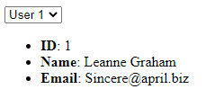

# Coderpad Frontend Code Challenge

### Getting started

To run the code challenge you will need a version of node installed >=12.0.0.

Download this repo then run the following commands in a terminal at the repo root:

```bash
npm install
```

This will install all the dependencies required to run the code challenge.

### Run the local server

```bash
npm run dev
```

Then navigate to [http://localhost:3000](http://localhost:3000) in your browser.

### The Challenge

The objective of the frontend code challenge is to create a UI which displays the ID, Name and Email address of a selected user. When a user is selected in the drop list, the ID, Name and Email address of the selected user should be displayed. Only one user should be displayed at a time.



Steps to implement:

- Replace the code in 'App.tsx' with your updates to produce the required UI.
- Store the response from the API request in state as a User object.
- Use side effects to update the User object based on the selection in the drop down.
- Only render the User object if the User object is defined.
- Ensure the code is type safe, update the App component from JS to TS.
